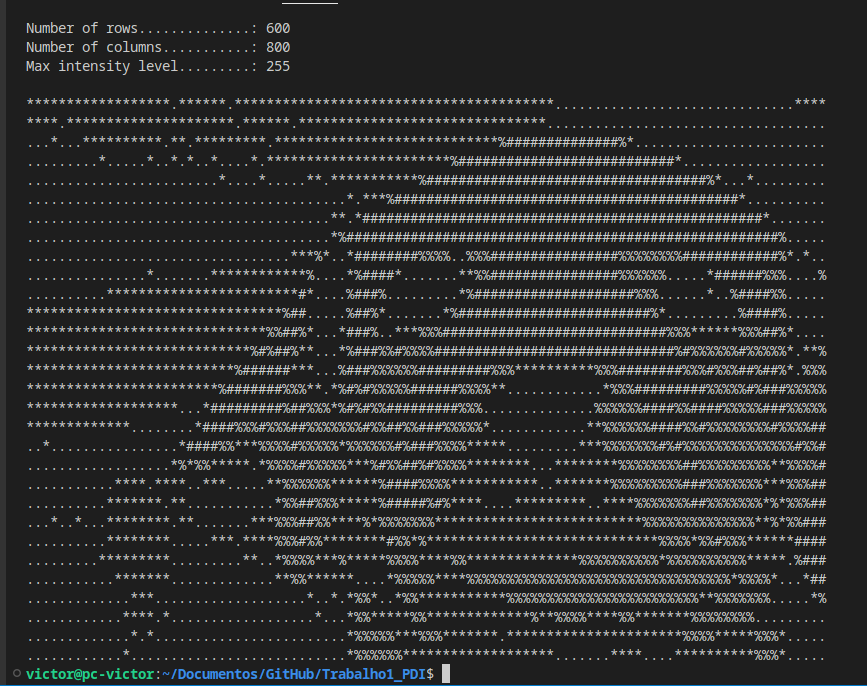

# Trabalho1_PDI
 Código em C que transforma imagens em formato .pgm em texto (ASCII).
## Comandos:
```
$ make
```
## Especifique imagem numero de linhas e de colunas:

./ascii imagem.pgm n_linhas n_colunas 'caracteres para os tons de cinza'

```
$ ./ascii cao.pgm 30 100 '.*%#'
```


